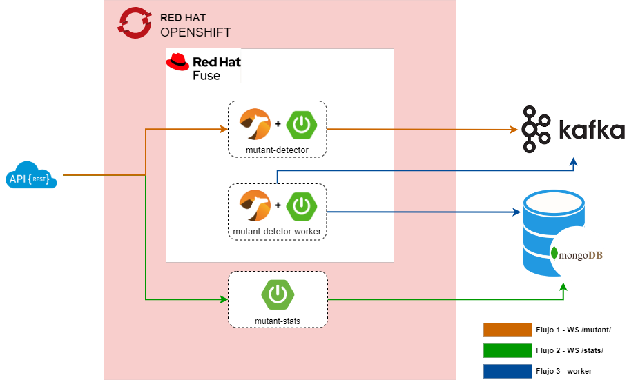

# Challenge técnico Mercado Libre
Challenge técnico Mercado libre, aplicación para detectar ADN Mutante

# Herramientas, tecnologías y lenguajes

- Sistema operativo: Windows 10
- Java 11
- Spring Boot 2.4.13
- Camel 3.7.0
- Undertow
- Eclipse IDE
- Visual Studio
- Jacoco
- Coveralls
- Travis CI
- JKube
- MongoDB
- Openshift
- Kubernetes
- Contenedores
- Apache kafka
- K6 Load Testing

### Arquitectura de software y patrones destacados
- Microservicios
- Patrón de Integración empresarial - EIP
- Arquitectura orientada a eventos 
- SOLID

# Arquitectura 

La solución propuesta se basa en una arquitectura de microservicios.
Se proponen 3 microservicios  para abordar el requerimiento, por una parte un ms ***mutant-detector*** el cual se encargara de exponer un servicio REST tipo POST para  realizar la validación de la secuencia de ADN. Este servicio enviara el resultado de la validación y la secuencia de ADN a un topic de Apache Kafka.  De esta manera, propone una arquitectura orientada a eventos, para persistir  los datos  de manera asíncrona, mejorando los tiempos de respuesta del servicio  y el comportamiento del mismo ante fluctuaciones agresivas de trafico.

El segundo microservicio ***mutant-detector-worker*** es uno de tipo worker, el cual se suscribira al topic de kafka para consumir los mensajes dejados por el servicio  ***mutant-detector*** y almacenarlos en la base de datos MongoDB. 

Finalmente un tercer microservicio ***mutant-stats*** el cual expone un servicio REST tipo GET para obtener las estadísticas de las validaciones de secuencias de ADN.

Se propone Openshift para realizar el despliegue y administración  de los servicios contenerizados en la nube.
Con esta arquitectura se busca  obtener una independencia entre las funcionalidades requeridas,  crecimiento horizontal y optimizar los recursos.

## Servicios en la nube utilizados para la prueba 

Para esta  prueba  se uso un servidor sandbox de  Redhat https://developers.redhat.com/developer-sandbox. En el mismo servidor se crea una instancia de Apache Kafka. 

Para configurar el acceso desde Openshift a mongo se utilizo el Add-on service  Data Access  https://access.redhat.com/documentation/en-us/red_hat_openshift_database_access/1/html-single/quick_start_guide/index

Para la base de datos se creo un cluster gratuito  tipo M0 en  Mongo Cloud Services  https://www.mongodb.com/cloud

## Repositorios de los microservicios 
- https://github.com/leosthewar/mutant-detector
- https://github.com/leosthewar/mutant-stats
- https://github.com/leosthewar/mutant-detector-worker

### ToDo
- Configuraciones para DevOps  ( CI/CD )
- Crear componente independiente (libreria o modulo) para logica del metodo isMutant  (paquete  com.meli.challenge.mutant.detector.validator)
- Exponer y/o asegurar los servicios a través de un Api Gateway
- Cache para las APIs

### Consideraciones ambientes 
- En el servidor sandbox de Openshift las aplicaciones son apagadas automáticamente después de 12 horas, por lo cual es necesario levantarlas manualmente
- El servidor Kafka tiene un tiempo de vida de 48 horas, pasado este tiempo se debe crear una nueva instancia  
- Al ser ambientes gratuitos se tienen restricciones en cuanto a  recursos  como conexiones, CPUs, memoria y almacenamiento
- Al momento de realizar la entrega los servicios se entregan desplegados pero dadas las consideraciones expuestas anteriormente, puede requerirse un redespliegue, en caso tal por favor solicitarlo vía correo electrónico.

 
